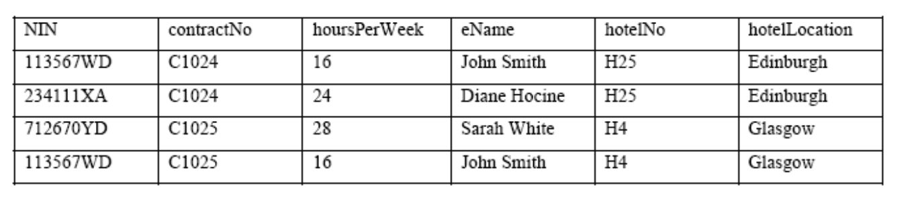

# QUIZ

Marriot

La red de hoteles "Marriot" quiere tener un sistema de información para la administración de su RRHH alrededor de todas las localidades que tiene en el Reino Unido, donde de manera inicial se propone una tabla para el sistema inicial:

